<figure>
  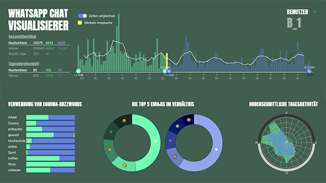
</figure>

SIMON WEBER, ALENA ROSLER, MORITZ DIETRICH, ALEXANDER HESS

# Whatsapp Chat Vis
Eine Untersuchung des Chatverhaltens zur Zeit des Social-Distancing

Dieses Projekt ist im Rahmen des Kurses “Grundlagen der Datenvisualisierung”, im Sommersemester 2020 bei Herrn Prof. Dr. Nagel, an der Hochschule Mannheim entstanden.

Du möchtest es ausprobieren? https://gdv-projekt.dietrichmedia.de/b_1.php

## Abstract
Zurzeit befindet sich die Welt in einem Ausnahmezustand und wir alle müssen in unserem
beruflichen, studentischen und privaten Leben nie dagewesene Herausforderungen
bewältigen. Um die Verbreitung des Covid-19-Virus einzudämmen, muss ein jeder sich
in seinen Freiheiten einschränken und Distanz zu seinen Mitmenschen wahren, was
allgemein als “Social Distancing” bezeichnet wird.
Für unser Semesterprojekt haben wir uns gefragt, wie zurzeit die Möglichkeiten digitaler
Kommunikationsformen ausgeschöpft werden und ob sich, aufgrund des stark
eingeschränkten physischen Kontaktes, die Nutzung von Messenger Diensten wie
WhatsApp verändert hat. Daraus entstand der “WhatsApp Chat Visualisierer”, der es
ermöglicht, das Chatverhalten ausgewählter Nutzer zu untersuchen.

Den im Laufe des Projektes entstandenen [Prototypen](https://gdv-projekt.dietrichmedia.de/b_1.php) haben wir öffentlich zugänglich gemacht. Aus datenschutztechnischen Gründen wurden die Namen der Benutzer anonymisiert.

## Einführung
Die Auswirkungen des Social Distancing machen sich in vielen Bereichen unseres
alltäglichen Lebens bemerkbar. Aufgrund des breit gefächerten Einflusses auf diverse
Themengebiete, stießen wir in der Findungsphase unseres Projektes auf vielfältige
Fragestellungen in den verschiedensten Bereichen, welche eine interessante Basis zur
visuellen Aufbereitung und Analyse der damit verbundenen Datensätze boten. Diese
reichten von der Änderung des Kaufverhaltens bei Videospielen, über das
Nutzungsverhalten diverser Streamingangebote, bis hin zur Analyse der Feinstaubbelastung
in großen Städten, bedingt durch den Rückgang des Pendlerverkehrs.
Bei all diesen Ansätzen stießen wir jedoch durchweg auf den Mangel an frei zugänglichen
Datensätzen, deren Existenz für das Gelingen dieses Projektes jedoch essenziell sind.
Letztendlich fiel unsere Wahl auf die Analyse des Chatverhaltens, in Bezug auf den
Messenger Dienst WhatsApp, da hier eine ausreichende und frei zugängliche
Datengrundlage vorhanden war. Intuitiv entstand die Vermutung, dass aufgrund fehlender
sozialer Kontakte im Alltag, sicherlich eine Änderung in der digitalen Kommunikation der
Menschen untereinander stattgefunden haben musste.

## Fragen und Hypothesen
Der Zweck einer jeden wissenschaftlichen Arbeit ist die Beantwortung einer oder mehrerer
Fragen oder Hypothesen. Während der Findungsphase unseres Projekts kamen diverse
Fragen und Vermutungen auf, weshalb sie im Folgenden die vier zentralen Fragestellungen
und dazugehörige Hypothesen finden, welche von dort an als Basis für die Analysen genutzt
wurden.

- *Wie hat sich die Nachrichtenmenge nach dem Social Distancing verändert?*
Schnell war uns klar, dass wir deutlich machen wollen, wie sich die Kommunikation über
WhatsApp verändert hat, sofern dies überhaupt der Fall sein sollte. Steigt sie an, weil die
Menschen sich nicht mehr treffen können? Oder sinkt sie sogar, weil lieber per Videochat
von Angesicht zu Angesicht kommuniziert wird?

- *Wie sieht das Nutzungsverhalten von bestimmten Corona-Buzzwords aus?*
Diverse Medien berichteten in der vergangenen Zeit über spezifische Wörter und auch
Wortgruppen, welche aufgrund der Corona-Pandemie verstärkt im Sprachgebrauch der
deutschen Bevölkerung vertreten waren und dies auch immer noch sind. Uns kam daher der
Gedanke, dieses Phänomen in Bezug auf das Chatverhalten zu analysieren.

- *Lässt sich anhand der verwendeten Emojis eine Veränderung des Stimmungsbildes ableiten?*
Die Verwendung von Emojis spiegelt oft unsere Stimmung in einer Unterhaltung wider.
Diese Tatsache bietet eine gute Basis, um das Stimmungsbild anhand der verwendeten
Emojis zu analysieren.

- *Zu welcher Tageszeit wird WhatsApp am häufigsten verwendet?*
Zu dieser Frage ergaben sich zwei Überlegungen. Erstens wollten wir untersuchen, zu
welcher Tageszeit WhatsApp meistens verwendet wird. Des Weiteren hielten wir es für
interessant zu untersuchen, ob derzeit, da der Präsenzbetrieb an Hochschulen,
Universitäten und Arbeitsplätzen eingestellt ist, sich die Nutzungszeit tendenziell eher nach
hinten verschoben hat, da man nicht mehr gezwungen ist, morgens früh aufzustehen.

Als zentralen Ankerpunkt unserer Untersuchungen wählten wir den Tag der
Ansprache durch die Bundeskanzlerin Angela Merkel (18.03.2020). Dieser Tag stellt unserer
Auffassung nach, den Beginn des Lockdowns in Deutschland dar. Um dieses Ereignis
herum wird im Folgenden der Zeitraum vom 01.02.2020 – 31.05.2020 betrachtet. Dies hat
den Hintergrund, dass somit ausreichend Daten vor und nach besagtem Ereignis zur
Verfügung stehen, um Aussagen über das Verhalten vor und nach dem
Lockdown treffen zu können.

## Datenbeschaffung und Aufbereitung
Aufgrund dessen, dass WhatsApp in Deutschland keine Möglichkeit mehr zum Export von
Chatverläufen anbietet, mussten wir einen Workaround verwenden, welcher jedoch lediglich
für IOS-Geräte funktioniert und darauf basiert ein unverschlüsseltes Backup der
Chatverläufe zu erstellen und dieses anschließend mit einem Tool (bspw. IExplorer) in eine
SQL-Lite Datenbank zu exportieren.
Ein entsprechendes Pendant für Android Endgeräte, welches im zeitlichen Rahmen unseres
Projekts umsetzbar gewesen wäre, konnten wir leider nicht finden. Daher beschränkten wir
uns im Folgenden auf Backups von Mobilgeräten mit IOS Betriebssystem.
Bei Interesse an der genauen Vorgehensweise zur Erstellung eines solchen Backups, kann
unter dem folgenden Link eine detaillierte Anleitung nachgelesen werden: [detaillierte
Anleitung zum Export von WhatsApp Chatverläufen](https://medium.com/@1522933668924/extracting-whatsapp-messages-from-backups-with-code-examples-49186de94ab4).

Nach einem erfolgreichen Export der SQL-Lite-Datei ist es nun möglich, die Daten bspw. mit
“DB Browser for SQL-lite” einzusehen, sowie diese in andere Formate, wie z. B. JSON, zu
konvertieren. Dies ermöglicht es, die gewonnenen Datensätze mit JavaScript
weiterzuverarbeiten.

Im ersten Schritt begannen wir mit der Filterung der Daten nach den von uns benötigten
Inhalten und Metainformationen. Aufgrund der zuvor getroffenen Entscheidung, einen
begrenzten Zeitraum für unsere Untersuchungen heranzuziehen, war es uns möglich, die
Datensätze stark in ihrem Umfang zu reduzieren. Ausgehend von den so gefilterten Daten
wurden nun drei separate JSON-Dateien pro WhatsApp-Nutzer generiert, welche im
Folgenden als Grundlage zur Auswertung und Analyse in unserem Prototypen dienen
sollten.

## Das Dashboard
Um die umfangreiche Datenbasis visuell aufzubereiten und so dem Nutzer übersichtlich zur
Exploration zur Verfügung zu stellen, erwies sich die Konzeption eines Dashboards als eine
praktikable Lösung.

### Die ersten Prototypen
Die grundlegende Funktionalität dieses Dashboards besteht darin, dass der Nutzer die
Möglichkeit hat, individuell Zeiträume auszuwählen und gegebenenfalls miteinander zu
vergleichen. Dies soll ihm ermöglichen, gezielt Daten zu explorieren und zu analysieren.
Darüber hinaus soll es eine Basis bieten, um die von uns aufgestellten Forschungsfragen
beantworten zu können. Dieser Vorgang soll mithilfe von Detaildiagrammen, welche die
Daten des aktuell ausgewählten Zeitraumes veranschaulichen, unterstützt werden.

<figure>
  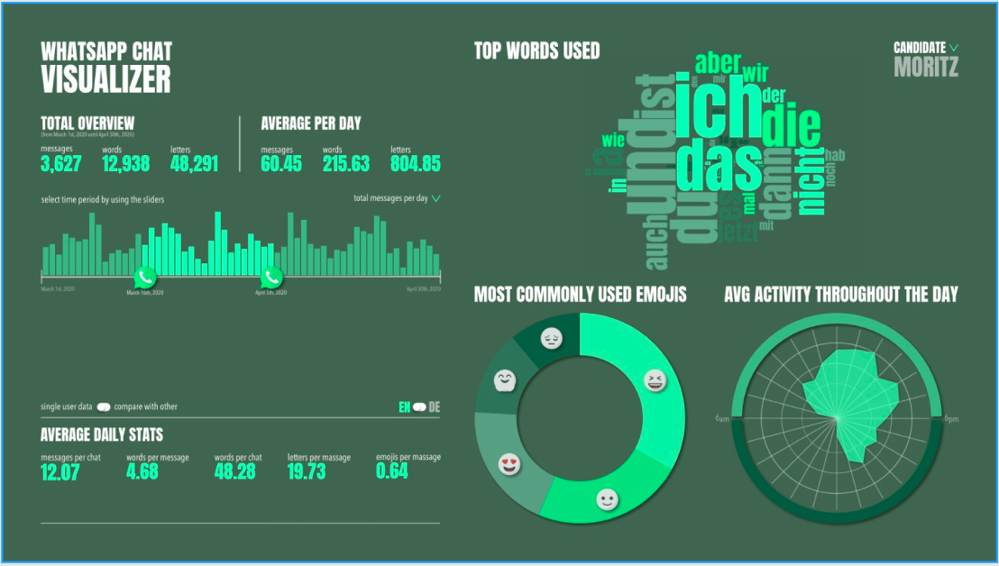
  <figcaption>Abbildung 1: Der erste Prototyp. Dieser ist angelehnt an ein klassisches Dashboard.</figcaption>
</figure>

 
Diesen Überlegungen zufolge fiel die Entscheidung vier unterschiedliche Diagramme zu
verwenden, welche jeweils der Beantwortung einer der Forschungsfragen dienen sollen.
Eines der Diagramme soll zudem als Control-Panel fungieren und es somit ermöglichen, per
Drag and Drop Slidern, Zeiträume auszuwählen. Der Inhalt der restlichen Diagramme wäre
somit abhängig von der durch den Nutzer getroffenen Auswahl.

Aus diesen Überlegungen heraus entstanden zunächst zwei unterschiedliche Prototypen.
Der erste (s. Abb. 1) war an ein klassisches Dashboard angelehnt, wohingegen Prototyp
zwei (s. Abb. 2) einen WhatsApp Chat nachstellen und in der Funktionalität der
Kommunikation mit einem Chatbot ähneln sollte.

Aufgrund dessen, dass die Interaktion mit einem Chatbot auf dem Senden von Nachrichten
basiert, würde der zweite Prototyp zu sehr von der ursprünglich angedachten
Bedienungsweise unseres Dashboards abweichen. Wir entschieden uns daher für die erste
Variante, da diese auf die grundlegenden Funktionen reduziert ist und im Gegensatz zum
Figure 1: Der erste Prototyp. Dieser ist angelehnt an ein klassisches Dashboard.
zweiten Prototyp keine spielerischen Aspekte oder ablenkenden Elemente enthält, welche
zu einer Reizüberflutung führen und somit den Nutzer beim gezielten Explorieren und
Analysieren der Daten behindern könnten.

<figure>
  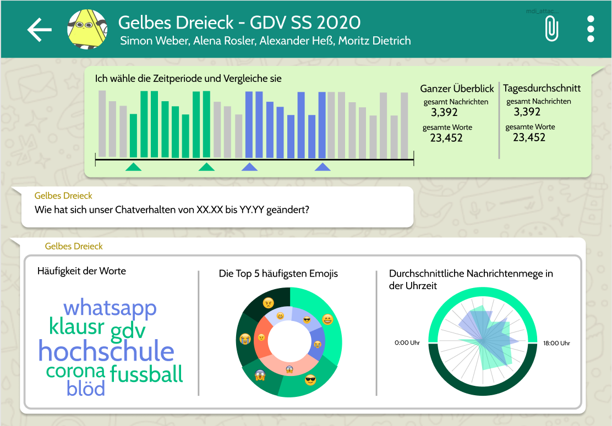
  <!--<figcaption >Figure 2: Zweiter Prototyp, welcher einem WhatsApp Chatverlauf ähnelt.</figcaption>-->
</figure>Figure 2: Zweiter Prototyp, welcher einem WhatsApp Chatverlauf ähnelt.
 

## Visualisierungstechniken
Im Laufe des Projektes haben wir verschiedene Visualisierungstechniken betrachtet und auf
Grundlage unseren Hypothesen evaluiert, welche bestmöglich die Beantwortung der zu
Beginn formulierten Fragestellungen unterstützen.

### Nachrichtenmenge (Balkendiagramm)
Um den zeitlichen Verlauf einer Größe darzustellen, eignet sich das Visualisieren der Daten
auf einem Zeitstrahl besonders gut. Das Nachrichtenmengen-Diagramm soll, in Form eines
Balkendiagramms, zeigen, wie viele Nachrichten an den einzelnen Tagen durch den Nutzer
geschrieben wurden. Um dem Nutzer das Erkennen von möglichen Trends zu erleichtern,
führten wir zusätzlich eine Trendlinie (gleitender Mittelwert über 7 Tage) in das
Balkendiagramm mit ein (s. Abb. 3).

<figure>
  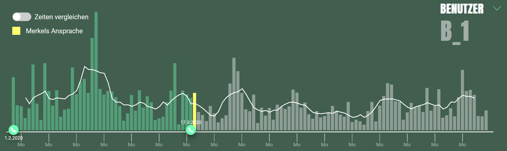
  <!--<figcaption >Figure 3: Das Balkendiagramm zeigt die Nachrichtenmenge an den jeweilige Tagen. Durch die hinzugefögte Trendlinie lassen sich Tendenzen in der Entwicklung der Nachrichtenmenge leichter erkennen.</figcaption>-->
</figure>

Figure 3: Das Balkendiagramm zeigt die Nachrichtenmenge an den jeweiligen Tagen. Durch die hinzugefügte Trendlinie lassen sich Tendenzen in der Entwicklung der Nachrichtenmenge leichter erkennen.
 

Zum besseren Überblick über die gesamte Nachrichtenmenge findet sich neben dem
Balkendiagramm ein Übersichtsbereich, welcher absolute Zahlen beinhaltet (s. Abb. 4). Zum
einen wird hier dargestellt, wie viele Nachrichten, mit wie vielen Wörter und an wie vielen
Tagen geschrieben worden sind. Darüber hinaus lassen sich, in der unteren Hälfte der
Tabelle, die dazugehörigen Mittelwerte ablesen.

<figure>
  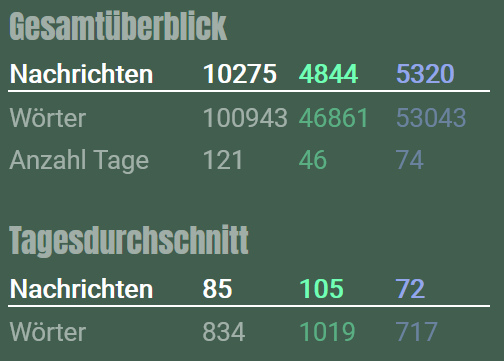
  <!--<figcaption >Figure 4: Der Übersichtsbereich gibt Auskunft über die absoluten Zahlen, sowohl des gesamten Zeitraumes als auch der aktuell ausgewählten Zeiträume.</figcaption>-->
</figure>

Figure 4: Der Übersichtsbereich gibt Auskunft über die absoluten Zahlen, sowohl des gesamten Zeitraumes als auch der aktuell ausgewählten Zeiträume.
 

### Corona Buzzwords (normalisiertes Balkendiagramm)
Zu Beginn wollten wir lediglich untersuchen, welche Wörter am häufigsten im
Sprachgebrauch der jeweiligen Nutzer vorkommen. Unsere Wahl fiel daher auf eine
Wordmap (s. Abb. 5).
Beim Evaluieren unserer Daten stellten wir jedoch fest, dass diese Visualisierungstechnik
einige Probleme mit sich brachte. Beispielsweise war es teilweise vonnöten, den Kopf um
90° zu drehen, um einige Wörter lesen zu können. Auch stellte es sich als kompliziert
heraus, anhand der Größenverhältnisse einzelner Wörter klar zu erkennen, welches
beispielsweise das am häufigsten geschriebene worden war. Die Wordmap ließ es somit
lediglich zu, einen groben Überblick darüber zu bekommen, welche der Wörter häufiger und
welche weniger häufig verwendet worden waren.

<figure>
  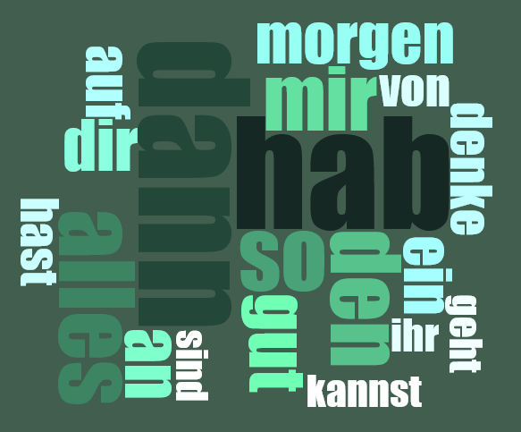
  <!--<figcaption >Figure 5: Die Wordmap stellt die Häufigkeit anhand der Größe des jeweiligen Wortes dar. Die Anordnung erfolgt dabei zufällig.</figcaption>-->
</figure>

Figure 5: Die Wordmap stellt die Häufigkeit anhand der Größe des jeweiligen Wortes dar. Die Anordnung erfolgt dabei zufällig.
 

Auf der Suche nach Alternativen, welche unseren Ansprüchen eher gerecht wurden,
standen das Windrose-Char und die Treemap in der engeren Auswahl.
Das Windrose-Char (s. Abb. 6) bot hierbei den Vorteil, eine runde Form zu haben und sich
somit gut in das Gesamtbild des unteren Bereiches unseres Dashboards einzufügen. Zudem
kann, anhand der hierarchischen Gliederung der einzelnen Elemente nach ihrer
Gewichtung, gut erkannt werden, welche Rangordnung in der Häufigkeit der Wörter
herrscht.

<figure>
  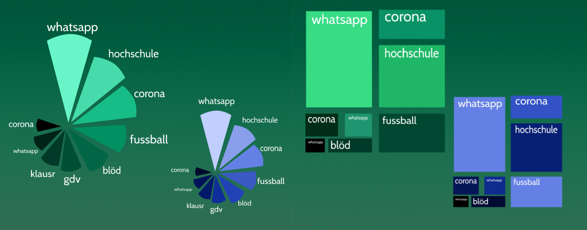
  <!--<figcaption >Figure 6: Windrose Chart (links) und Treemap (rechts) als alternative Visualisierungstechniken zur Darstellung der Worthäufigkeiten.</figcaption>-->
</figure>

Figure 6: Windrose Chart (links) und Treemap (rechts) als alternative Visualisierungstechniken zur Darstellung der Worthäufigkeiten.
 

Die in Abbildung 6 dargestellte Treemap bietet zwar ebenfalls die Möglichkeit zur Erkennung
der am häufigsten geschriebenen Wörter, ist jedoch, aufgrund einer fehlenden Ordnung,
weniger intuitiv lesbar als das Windrose-Chart.
Aufgrund dessen, dass wir keine wirklich zufriedenstellende Lösung für unser Problem
finden konnten, kamen wir letztendlich zu dem Schluss, unsere Forschungsfrage, deren
Beantwortung wir mit diesem Diagramm unterstützen wollten, nochmals zu überdenken. Wir
entschieden uns dazu, eine festgelegte Menge von 10 Corona-Buzzwords zu definieren. Für
diese Auswahl wollten wir dem Nutzer unseres Dashboards nun ermöglichen, deren
jeweilige Verwendung in den verschiedenen Zeiträumen zu analysieren.
Diese Entscheidung hatte zudem zum Vorteil, dass unser Dashboard somit näher am
eigentlichen Thema, dem Social Distancing während der Corona-Zeit, agierte. In der zuvor
verwendeten Wordmap waren nämlich keinerlei Corona bezogene Wörter aufgetaucht, da
diese, im Vergleich zu diversen Bindeworten der deutschen Sprache, eher selten genutzt
werden.
Um unsere Buzzwords auszuwählen, sammelten wir zunächst alle Wörter, welche unserer
Meinung nach mit Corona in Verbindung stehen. Es entstand eine Liste, bestehend aus ca.
250 Einträgen, von denen wir letztendlich 10 auswählten. Wir priorisierten dabei anhand von
Kriterien, welche auf uns als junge Studenten am ehesten zutreffend waren. Dies hatte den
Hintergrund, dass die verwendeten Datensätze von Personen unseres Profils stammen.
Da die Deadline des Projektes immer näher rückte und wir somit nicht mehr viel Zeit hatten,
um weitere Diagramme evaluieren zu können, entschieden wir uns letztendlich für ein
normalisiertes Balkendiagramm (s. Abb. 7).
Der gesamte Balken repräsentiert dabei alle Vorkommnisse des jeweiligen Buzzwords im
maximal verfügbaren Zeitraum. Wählt der Benutzer nun kleinere Zeiträume, wie im Beispiel
der Abbildung 7, sieht er die jeweiligen Anteile an der Anzahl der gesamten Vorkommnisse
und kann diese miteinander vergleichen.

<figure>
  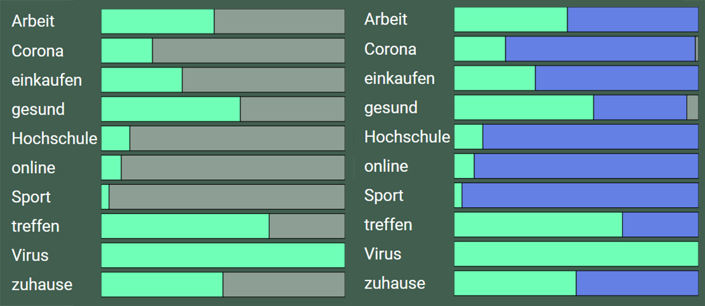
 <!-- <figcaption >Figure 7: Das normalisierte Balkendiagramm dient der Darstellung des Anteils ausgewählten Zeiträume an der
Anzahl der gesamten Vorkommnisse eines spezifischen Buzzwords. Abgebildet ist sowohl die Einzelansicht
(links) als auch die Vergleichsansicht (rechts).</figcaption>-->
</figure>

*Figure 7: Das normalisierte Balkendiagramm dient der Darstellung des Anteils ausgewählten Zeiträume an der
Anzahl der gesamten Vorkommnisse eines spezifischen Buzzwords. Abgebildet ist sowohl die Einzelansicht
(links) als auch die Vergleichsansicht (rechts).*
 

### Top 5 Emojis (Donut Chart)
Bei der Auswahl der Visualisierungstechnik für das Nutzungsverhalten der Emojis fiel unsere
Wahl auf ein klassisches Donut Chart. Dies hatte den Hintergrund, dass eine derartige
Visualisierung sehr gut geeignet ist, um die Anteile einzelner Elemente an einer
Gesamtsumme zu veranschaulichen. Ein Pie Chart hätte die gleiche Funktionalität geboten,
fiel jedoch aufgrund des im Vergleich eher mächtigen Erscheinungsbildes recht schnell aus
dem Rennen.
Der Hauptgrund für die Begrenzung auf die ersten fünf Emojis der Rangliste war, dass wir
somit jederzeit eine gute Leserlichkeit des Diagramms gewährleisten können.

### Durchschnittliche Tagesaktivität (Circular Area Chart)
Das Circular Area Chart ist eine häufig verwendete Visualisierungstechnik, wenn es um das
Darstellen zeitlich bezogener Aktivitätsverhältnisse geht, da es ähnlich einer Uhr zu lesen
ist. Aufgrund der etwas unüblichen Einteilung in 24 Stunden, statt der herkömmlichen 12
einer Uhr, kann dieses Diagramm auf den ersten Blick etwas schwer zu lesen sein. Um dem
entgegenzuwirken, verwendeten wir zusätzlichen eine Markierung der Tagesabschnitte
durch sowohl farbliche Halbkreise, welche eine Unterteilung in Tag und Nacht darstellen
sollen, als auch eine numerische Skala am äußeren Rand des Diagramms.
Wie in Abbildung 8 zu sehen, ist das Circular Area Chart hervorragend für den Vergleich
zweier unterschiedlicher Zeiträume geeignet, da sich die jeweils farblich hervorgehobenen
Flächen, anhand ihrer Größe und Position vergleichen lassen.

<figure>
  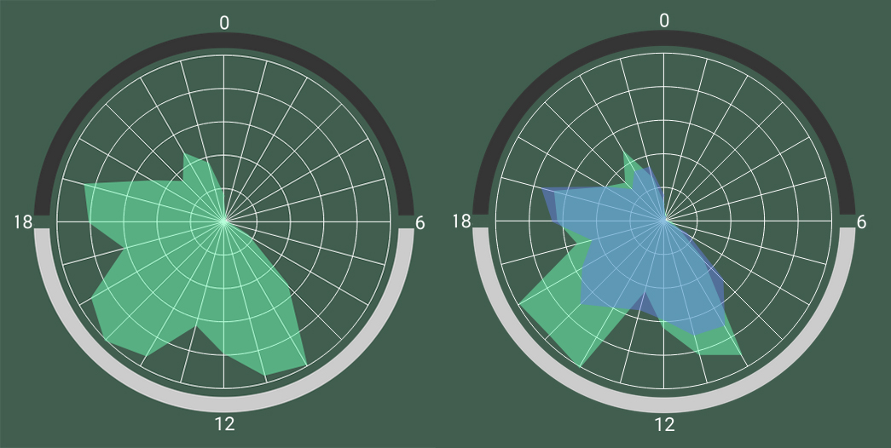
 <!-- <figcaption >Figure 8: Die durchschnittliche Tagesaktivität wird in einem Circular Area Chart dargestellt,
welches einer herkömmlichen Uhr ähnelt. In der Vergleichsansicht (rechts) liegen die
beiden Aktivitätsbereiche übereinander und können somit optimal verglichen werden.</figcaption>-->
</figure>

*Figure 8: Die durchschnittliche Tagesaktivität wird in einem Circular Area Chart dargestellt,
welches einer herkömmlichen Uhr ähnelt. In der Vergleichsansicht (rechts) liegen die
beiden Aktivitätsbereiche übereinander und können somit optimal verglichen werden.*
 

## UI/UX - Detailentscheidungen

### Farbschema
Angelehnt an die WhatsApp Farbpalette entschieden
wir uns dafür, ebenfalls Grüntöne als Grundfarben für
unser Dashboard zu wählen. Um den Unterschied
zwischen den beiden Zeiträumen in der
Vergleichsansicht visuell hervorzuheben, wählten wir
Blautöne, in ähnlicher Abstufung.
Zum Setzen von Akzenten kam zunächst ein kräftiger
Rotton (s. Abb. 9) zum Einsatz, welcher jedoch
letztendlich durch einen, zum restlichen Farbschema
weniger komplementären, Gelbton, für das Markieren
von Merkels Ansprache, und einer weißen Trendlinie
ersetzt wurde (s. Abb.11).

<figure>
  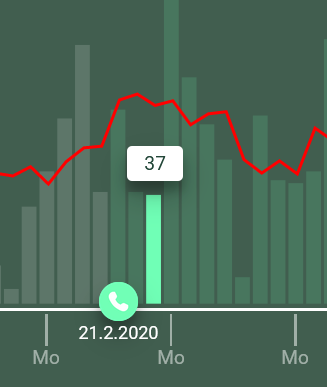
  <!--<figcaption >Figure 9: Durch die rote Farbe hebt sich
die Trendlinie vom Rest des Diagramms
ab.</figcaption>-->
</figure>

*Figure 9: Durch die rote Farbe hebt sich
die Trendlinie vom Rest des Diagramms
ab.*
 

### Das Layout
Abweichend von unseren ersten Prototypen, entschieden wir uns letztendlich dafür, das
gesamte Dashboard horizontal in zwei Bereiche zu unterteilen. Im oberen Bereich befinden
sich die Elemente, welche dem Nutzer zunächst einen Gesamtüberblick bieten sollen und
zugleich zur Steuerung des Dashboards angedacht sind. Dazu gehören der quantitative
Gesamtüberblick, über sowohl Nachrichtenmenge als auch Angaben über geschriebene
Wörter, und das Nachrichtenmengen-Diagramm, in welchem die zentralen
Steuerungselemente des Dashboards enthalten sind.
In der unteren Hälfte sind die drei Detaildiagramme platziert, welche nicht individuell
gesteuert werden können, sondern sich dynamisch den oben ausgewählten Zeiträumen
anpassen.
Somit sind alle Steuerungselemente in der oberen Hälfte zentralisiert, was eine erleichterte
Bedienung für den Benutzer darstellt.

<figure>
  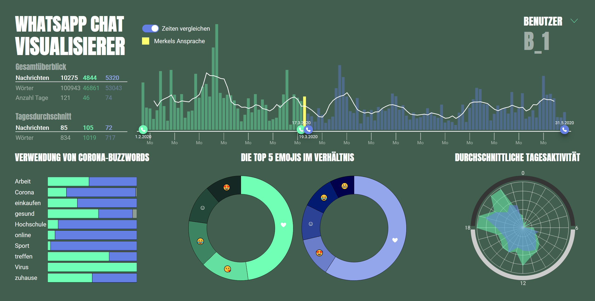
 <!-- <figcaption >Figure 10: Das fertige Dashboard, hier in der Vergleichsansicht, besteht aus einem Übersichtsbereich (obere
Hälfte) und einem Bereich mit Detaildiagrammen (untere Hälfte).</figcaption>-->
</figure>

*<figcaption >Figure 10: Das fertige Dashboard, hier in der Vergleichsansicht, besteht aus einem Übersichtsbereich (obere
Hälfte) und einem Bereich mit Detaildiagrammen (untere Hälfte).*
     

Zur Visualisierung des Emoji-Diagramms in der Vergleichsansicht entschieden wir uns, im
Gegensatz zu den übrigen Diagrammen, für eine Trennung in zwei separate Donut Charts
(s. Abb. 10). Dies hatte den Hintergrund, dass durch eine gemeinsame Darstellung beider
Zeiträume in einem Diagramm, immer einer der beiden Ringe optisch kleiner gewesen wäre.
Dies hätte unter Umständen zu einer Verfälschung bei der Interpretation der
Größenverhältnisse geführt.

### Typografie
Für den Dashboard-Titel, die Benutzerauswahl und die Überschriften entschieden wir uns für
eine sehr plakative Schriftart, welche bei Google-Fonts unter dem Namen [Anton](https://fonts.google.com/specimen/Anton?query=anton) zu finden
ist. Für das restliche Dashboard wählten wir die feine, serifenlose und gut leserliche Schrift
[Roboto](https://fonts.google.com/specimen/Roboto?query=roboto)(ebenfalls von Google-Fonts) aus, welche aufgrund dessen nicht zu sehr ins Auge
sticht und somit eine möglichst geringe Ablenkung von den eigentlichen Diagrammen
darstellt.

### Interaktionen
Die Hauptinteraktion, welche zwischen dem Nutzer und unserem Dashboard entstehen soll,
ist das individuelle Auswählen von Zeiträumen. Dies geschieht durch Drag and Drop
Schieberegler, welche auf der Zeitachse des zentralen Steuerungsdiagramms lokalisiert sind
und es dem Nutzer ermöglichen, Zeiträume zwischen 2 und 121 Tagen auszuwählen.
<figure>
  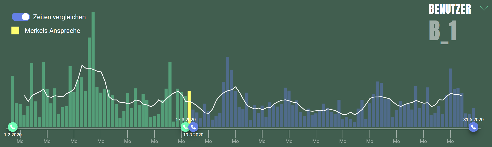
  <!--<figcaption >Figure 11: Die Schieberegler unterhalb des Nachrichtenmengen-Diagramms bieten dem Nutzer die Möglichkeit
individuell Zeiträume auszuwählen.</figcaption>-->
</figure>

*Figure 11: Die Schieberegler unterhalb des Nachrichtenmengen-Diagramms bieten dem Nutzer die Möglichkeit
individuell Zeiträume auszuwählen.*
 

Durch das Wechseln in die Vergleichsansicht (s. Abb. 11) besteht darüber hinaus die
Möglichkeit, mit zwei Schieberegler-Paaren sowohl gleich lange als auch unterschiedliche
Zeiträume miteinander zu vergleichen. Um das Auswählen von Zeiträumen gleicher Länge
zu erleichtern, findet sich im Bereich des Gesamtüberblickes (s. Abb. 4) eine Angabe über
die Anzahl der aktuell ausgewählten Tage.
Darüber hinaus bietet das Dashboard an vielen Stellen
die Möglichkeit über Elemente einzelner Diagramme
zu hovern. Beispielhaft hierfür ist in Abbildung 12 das
Hovern über einen einzelnen Tag im
Nachrichtenmengen-Diagramm abgebildet. Diese
Interaktion bietet dem Nutzer die Möglichkeit, sich die
Nachrichtenmenge als absolute Zahl anzeigen zu
lassen.
Ein Dropdown-Menü am rechten oberen
Bildschirmrand (s. Abb. 10) ermöglicht es dem Nutzer
zudem, zwischen den Datensätzen der verschiedenen
Nutzer zu wechseln.

<figure>
  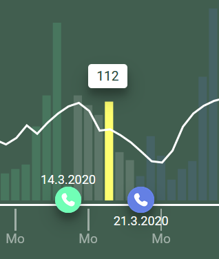
  <!--<figcaption >Figure 12: Beim Hovern über einen Balken
wird ein Dialog sichtbar, welcher die Anzahl
der Nachrichten des jeweiligen Tages
anzeigt.</figcaption>-->
</figure>

*Figure 12: Beim Hovern über einen Balken
wird ein Dialog sichtbar, welcher die Anzahl
der Nachrichten des jeweiligen Tages
anzeigt.*
 

## Implementierung
Innerhalb unserer Gruppe ergab sich recht schnell der allgemeine Konsens, dass wir eine
Desktop optimierte Webanwendung entwickeln möchten.
Das grundlegende Gerüst wurde mit HTML und CSS entwickelt. Darauf aufbauend kam das
JavaScript Framework D3 zu Einsatz, welches eines der bekanntesten Visualisierungs-Frameworks ist und sich in unserem Entscheidungsprozess, aufgrund seiner Vielfältigkeit
und guten Lernkurve, schnell gegen Alternativen wie Google Charts und Toast UI Charts
durchgesetzt hat.
Zur Umsetzung der Drag and Drop Funktionalität kam darüber hinaus die Library JQuery UI
zum Einsatz.
Wir entschieden uns bewusst dafür, kein zusätzliches serverseitiges Framework zu
verwenden und die Datenaufbereitung innerhalb des Dashboards, komplett clientseitig, in
D3 abzuwickeln. Mit ein Grund für diese Entscheidung war, dass sich unser Dashboard bei
jeder Änderung der ausgewählten Zeiträume komplett aktualisieren muss. Da dieser
Vorgang, bei einer wie von uns angedachten Nutzung sehr häufig vorkommt, wollten wir so
vermeiden, dass die Webseite jedes Mal neu geladen werden muss und so ein flüssiger
Workflow des Benutzers behindert würde.

## Erkenntnisse
Im Folgenden wird auf jede der vier Fragestellungen einzeln eingegangen und erläutert,
welche Erkenntnisse mithilfe unseres Dashboards zu erlangen sind. Als Anhaltspunkt für
den Vergleich wählten wir das Datum der Ansprache der Bundeskanzlerin vom 18.03.2020.
Die hier aufgeführten Erkenntnisse und die darauf aufbauenden Schlussfolgerungen
basieren lediglich auf den drei Datensätzen, welche von Mitgliedern unserer Gruppe und
deren Bekannten stammen. Somit sind sie keinesfalls repräsentativ für das Chatverhalten
größerer Bevölkerungsgruppen.

- *Wie hat sich die Nachrichtenmenge nach dem Social Distancing verändert?*
Entgegen unseres intuitiven Verdachts, dass aufgrund des Social Distancing die
Kommunikation über Messenger Dienste wie WhatsApp zunehmen müsse, konnten wir bei
zwei unserer drei Datensätze feststellen, dass die Nachrichtenmenge pro Tag tendenziell
eher rückläufig war. In Zahlen ausgedrückt belief sich besagter Rückgang, im Vergleich zum
Zeitraum vor Merkels Ansprache, auf 25 - 30 %. Lediglich bei einem der drei Nutzer ließ sich
ein leichter, jedoch kaum merkbarer, Zuwachs von ca. 2 % in der Menge der gesendeten
Nachrichten verzeichnen.

- *Wie sieht das Nutzungsverhalten von bestimmten Corona-Buzzwords aus?*
Hier ließ sich vor allem in Bezug auf die beiden Begriffe “Virus” und “Corona” eine
interessante Entwicklung beobachten. Bei allen drei Nutzern, deren Daten uns zur
Verfügung standen, stellte sich heraus, dass der Begriff “Virus” fast ausschließlich im
Zeitraum vor Merkels Ansprache und hingegen der Begriff “Corona” fast ausschließlich im
danach verwendet wurde. An dieser Stelle stellten wir die Vermutung auf, dass, zu Beginn
der Pandemie, im täglichen Sprachgebrauch größtenteils “vom unbekannten Virus”
gesprochen wurde und sich die Bezeichnung Corona erst im Laufe der Zeit durchsetzte und
„den Virus“ ablöste.

- *Lässt sich anhand der verwendeten Emojis eine Veränderung des Stimmungsbildes ableiten?*
Leider ließ der Umfang unserer Daten keine zufriedenstellende Analyse einer möglichen
Änderung im Stimmungsbild zu. Dies lag unter anderem daran, dass diese durchweg sehr
einseitig durch das Herz-Emoji dominiert wurden. Wir vermuten jedoch, dass bei einer
deutlich höheren Anzahl an Datensätzen eine solche Auswertung durchaus sinnvoll wäre
und interessante Ergebnisse liefern könnte.

- *Zu welcher Tageszeit wird WhatsApp am häufigsten verwendet?*
Insgesamt verteilt sich die Chat-Aktivität unserer Nutzer auf einen Zeitraum von 05:00 bis
24:00 Uhr, wobei sich die Ballungspunkte eher im Bereich zwischen 8:00 und 22:00 Uhr
befinden. Bei zwei der drei Datensätze lässt sich ein leichter Rückgang der Aktivität
innerhalb der späten Abendstunden erkennen. Darüber hinaus ist die generelle Verteilung
recht konstant geblieben.

## Fazit
Wenngleich wir nicht alle der von uns formulierten Fragestellungen zu unserer vollsten
Zufriedenheit beantworten konnten, sind wir mit dem letztendlichen Ergebnis unseres
Projektes sehr zufrieden. Unser Prototyp ermöglichte es uns, unsere Forschungsfragen
detailliert zu untersuchen und bietet darüber hinaus sicherlich noch reichlich Erkenntnisse,
deren Entdeckung bisher noch offengeblieben ist.
Wir laden Sie als Leser daher recht herzlich ein, die von uns gesammelten Daten selbst zu
explorieren und gegebenenfalls eigene Nachforschungen anzustellen.

## Ausblick
Sollte diese Arbeit weitergeführt werden, wäre es aus unserem Standpunkt durchaus
sinnvoll, dies mit einer deutlich höheren Anzahl an Datensätzen zu tun. Dies hätte zur Folge,
dass die darauf basierenden Analysen sowohl an Repräsentativität gewinnen würden als
auch detailreichere Erkenntnisse bieten sollten.
Darauf aufbauend wäre es ratsam, Durchschnittsdatensätze zu bilden und so die einzelnen
Nutzer nicht mehr isoliert zu betrachten, was bei einer deutlich erhöhten Anzahl zudem nicht
mehr praktikabel wäre. Diese ließen sich auch in verschiedene Altersgruppen und oder nach
Geschlecht unterteilen, was weitere Analyseansätze herbeiführen würde.